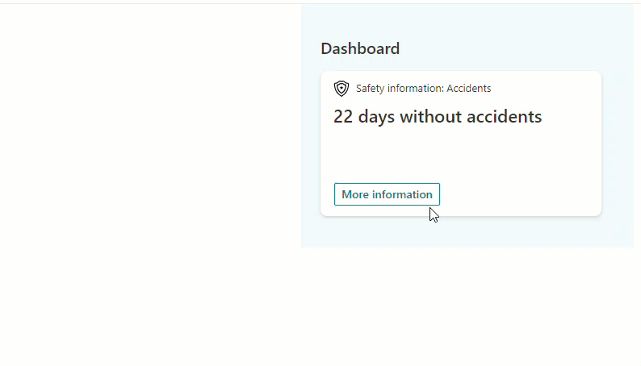

# Accident Counter Solution

## Summary

This Adaptive Card Extension displays number of days without accidents. QuickView displays also number of accidents during this month and this year.
Editor can customize the title of the ACE card, card description and icon.

## Prerequisites
Data for the solution is hosted on a SharePoint list, which is added on SharePoint Home Site.
- Create a SharePoint list named 'Accidents'.
- Add column named 'AccidentDate', type Date/Time. Mark as required
- Set Title column as not required.

## Used SharePoint Framework Version

## Applies to

- [SharePoint Framework](https://aka.ms/spfx)
- [Microsoft 365 tenant](https://docs.microsoft.com/en-us/sharepoint/dev/spfx/set-up-your-developer-tenant)

> Get your own free development tenant by subscribing to [Microsoft 365 developer program](http://aka.ms/o365devprogram)

## Solution

Solution|Author(s)
--------|---------
spfx-ace-accident-counter | Matti Paukkonen, [Tahto Group](https://tahtogroup.fi), [@mpaukkon](https://twitter.com/mpaukkon)

## Version history

Version|Date|Comments
-------|----|--------
1.0|March 3, 2022|Initial release

## Disclaimer

**THIS CODE IS PROVIDED *AS IS* WITHOUT WARRANTY OF ANY KIND, EITHER EXPRESS OR IMPLIED, INCLUDING ANY IMPLIED WARRANTIES OF FITNESS FOR A PARTICULAR PURPOSE, MERCHANTABILITY, OR NON-INFRINGEMENT.**

---

## Minimal Path to Awesome

- Clone this repository
- Create the SharePoint list described in pre-requisites
- Ensure that you are at the solution folder
- in the command-line run:
  - **npm install**
  - **gulp serve**
- browse to your hosted workbench https://<tenant>.sharepoint.com/_layouts/15/workbench.aspx

## Features
This extension utilizes
- Using PnPJS to get data from a SharePoint list
- Using MomentJS to calculate dates.
- Using custom QuickViewTemplate adaptive card

## References

- [Getting started with SharePoint Framework](https://docs.microsoft.com/en-us/sharepoint/dev/spfx/set-up-your-developer-tenant)
- [Building for Microsoft teams](https://docs.microsoft.com/en-us/sharepoint/dev/spfx/build-for-teams-overview)
- [Use Microsoft Graph in your solution](https://docs.microsoft.com/en-us/sharepoint/dev/spfx/web-parts/get-started/using-microsoft-graph-apis)
- [Publish SharePoint Framework applications to the Marketplace](https://docs.microsoft.com/en-us/sharepoint/dev/spfx/publish-to-marketplace-overview)
- [Microsoft 365 Patterns and Practices](https://aka.ms/m365pnp) - Guidance, tooling, samples and open-source controls for your Microsoft 365 development